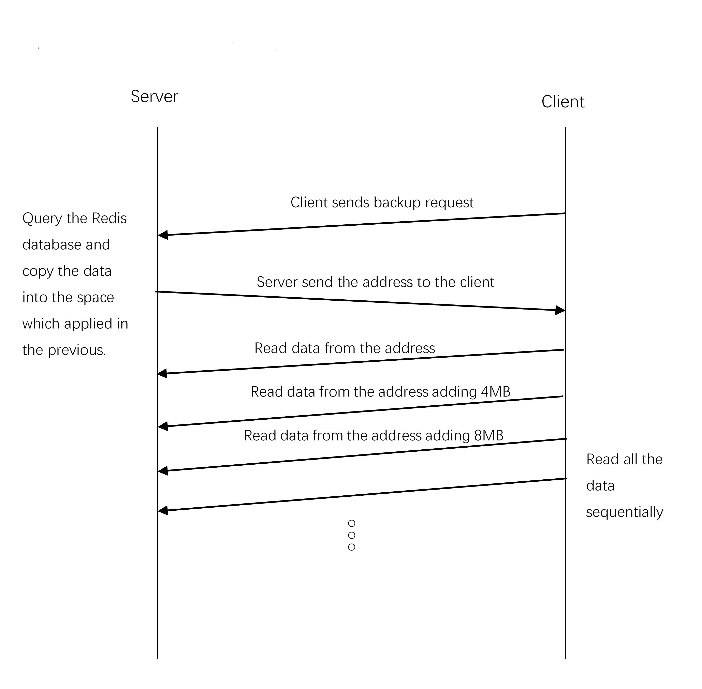
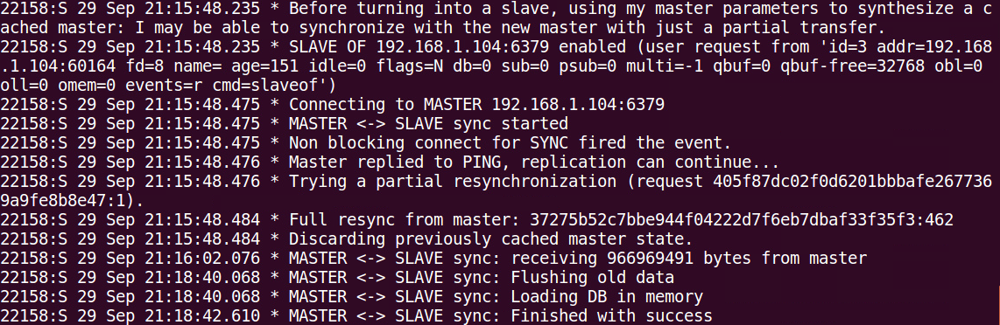

# Rdma Accelerating Redis

## 1 Introduction

There is a very simple way to use and configure Master-Slave replication because Master-Slave strategy is supported in Redis. You can initiate Master-Slave mode in Redis by specifying `SLAVEOF` in configuration file or run `SLAVEOF` command in the terminal. Table 1-1 shows the time consuming situation for building a different number of slaves for a Redis server with a 1GB image buffer.

Table 1-1 Time consuming of 1GB data using redis master-slave operation

| Slave number | Time consuming(s) | Bandwidth(MB/s) |
| ------------ | ----------------- | --------------- |
| one          | 98                | 10.4            |
| two          | 174.3             | 5.87            |
| three        | 259.89            | 3.94            |

**The mechanism of the Redis Master-Slave policy:** Master writes all the pairs of Key-Value into local HDD or SSD after receiving the synchronization request from the slave. Then master starts a background thread to send the file to the slave, when the slave receives the file and then writes the content to the local redis server. In this way, the master and the slave have have exactly the same data. But in the master-slave mode, the slave is read-only, and only the master can receive the write request.

The result in Table 1-1 is the time-consuming situation in which the slave synchronizes to the end of the request with only 1 GB of data. It demonstrates that when the amount of data is more and more slaves are simultaneously requesting as slaves, the performance of the master-slave mode is even worse. The main reasons are as follows:

1. The master writes all the data in memory to the local disk first, and then sends it through the network. The data is written to the disk, and then read from the disk when sent so I/O operation induces large overhead, and the read and write performance of the disk is also very poor.
2. When multiple slave requests are synchronized, the data is transmitted over the TCP network. The TCP network induces a large overhead, and performance will be worse when there is competition.

RDMA permits high-throughout, low-latency networking, which is especially useful in massively parallel computer clusters. Therefore, implementing the master-slave mode through RDMA can greatly improve performance. The experimental results show that the master-slave mode implemented by RDMA is 35 times-80 times better than the master-slave mode implemented by TCP. Table 1-2 shows the results.

Table 1-2 Comparison of TCP and RDMA for Master-Slave

| Slave   number | Origin Time-consuming(s) | RDMA Time-consuming(s) |
| -------------- | ------------------------ | ---------------------- |
| one            | 98                       | 2.8                    |
| two            | 174.3                    | 2.7                    |
| three          | 259.89                   | 3.33                   |

## 2 RDMA Master-Slave Solution

We implemented an master-slave synchronization solution by using RDMA, and the main reasons for the performance improvement are as follows:

1. The data transfer between master and slave is via RDMA read. RDMA read is a one-side operation, all slaves can read data from the master memory in parallel, without causing network competition.
2. The master's data does not be written to disk. The master creates a mapping table in the memory. The mapping table is composed of consecutive fixed-size data areas. The master maps the key-value stored in the memory to the mapping table, and the slave obtains data from the mapping table.
3. The slave only knows the starting address of the mapping table on the master. The slave calculates the address of the data on the mapping table by adding the starting address, and directly reads the data from the master memory area by using RDMA read. Figure 1-2 shows the detailed process.




Figure 1-2 Master-slave using RDMA and Mapping Table


The master-slave synchronization scheme implemented by RDMA has outstanding performance. The performance of master and slave synchronization is not affected by the number of slaves, which benefits from RDMA read unilateral operation. In the Redis TCP master-slave model, the master sends the file in the disk to all slaves. The more slaves, the greater the network pressure of the master and the worse the performance of the transmission. However, the RDMA master-slave hands over the task of acquiring data to the slave. With the RDMA unilateral operation and the kernel-bypass feature, the performance of data synchronization will hardly be affected no matter how many slaves. Figure 1-3 shows the bandwidth comparison for master-slave mode between TCP and RDMA. 


Figure 1-3 Comparison of bandwidths in two master-slave mode

The figure above shows that the RDMA master-slave mode bandwidth is only 345MB/s, because our calculation are consistent with Redis TCP master-slave's method of calculating bandwidth. The total amount of data transferred is divided by the total time spent on synchronization. The total time spent includes the time of data transmission and the time it takes to modify the local Redis server after the slave receives the data. In fact, if we only calculate the time of data transmission, the bandwidth we tested in the experiment is about twice that of the above figure.

## 3 How to Run

The experimental hardware environment and software environment are as follows:

| Hardware                     | Configuration                          |
| ---------------------------- | -------------------------------------- |
| CPU                          | Intel(R) Core(TM) CPU i7-7700@ 3.60GHz |
| Memory                       | 16GB                                   |
| Disk                         | TOSHIBA 1T HDD                         |
| Infiniband Switch            | Mellanox MSX1012B-2BFS 40GE QSFP       |
| Infiniband Network Interface | Mellanox MCX353A-FCBT 40GbE            |
| Ethernet Router              | Tplink                                 |
| Ethernet Network Interface   | Realtek PCIe GBE                       |

| Software          | Configuration                                  |
| ----------------- | ---------------------------------------------- |
| OS                | Ubuntu 16.04.3 LTS                             |
| Infiniband Driver | MLNX_OFED_LINUX-4.4-2.0.7.0-ubuntu16.04-x86_64 |
| Redis             | 4.0.11                                         |
| Gcc               | 5.4.0                                          |
| hiredis           | Included in redis 4.0.11                       |

In the repository, the `src` directory contains three directories, where the `redis` directory contains the redis source code with the modified configuration file; the `redis-init` directory contains the code first to initialize the data in the redis database; the `rdma` directory includes the `client` and `server` directories, which are used to run on the slave and master respectively.

The Infiniband driver is required but not described here. The only plugin the user needs to install is `hiredis`, which is a C language redis library that is included in the redis source. Here's how to install `hiredis`.

```shell
tar -zxvf redis-4.0.11.tar.gz
cd redis-4.0.11/deps/hiredis/
make 
sudo make install
```

After the installation is complete, a file named `libhiredis.so` will be generated in the current directory, and the file must be copied to `/usr/lib64`. If the `/usr/lib64` directory does not exist, shared object file must be copied to the `/usr/lib` directory. Then update the dynamic link library cache.

```shell
sudo cp libhiredis.so /usr/lib64
sudo /sbin/ldconfig
```

Here, `hiredis` is installed successfully, we can use the `hiredis` header file in the C language to operate Redis.

### 3.1 Master-Slave Cluster

Here's how to run the program we provide to get the results we described above. We assume that we are building a master and two slave environment tests.

Execute `make` command in the `redis-4.0.11/` directory to compile Redis. Then run `redis-server` in `src/`directory with specified configuration file.

```shell
cd redis-4.0.11
make
cd src
./redis-server ../redis.conf
```

**NOTE:** The other two machines also start the `redis-server` in the same way above.

Now assume that the three machines are configured as follows:

| Name   | IP            | Port |
| ------ | ------------- | ---- |
| master | 192.168.1.100 | 6379 |
| slave1 | 192.168.1.101 | 6379 |
| slave2 | 192.168.1.102 | 6379 |

Now set slave1 synchronous master data, the master data should be initialized before data synchronization, this section refers to 3.2 summary. First open a new terminal on the master machine into `src` directory, and perform a `redis-cli` connection to slave1.

```shell
cd redis-4.0.11/src
./redis-cli -h 192.168.1.101 -p 6379
```

If no exception occurs, the master is already connected to the Redis service of slave1, and then the run `slaveof` command.

```shell
slaveof 192.168.1.100 6379
```

The master and slave1 data synchronization related logs can be seen in the redis-server program output of master and slave1, as shown below:



From the log, we can see the time from the start of the slave synchronization to the receipt of all the master data and stored in memory, based on which we can calculate the performance of the synchronization.

The above is the process of synchronizing data data between the master and a slave. The process of synchronizing multiple slaves with the master is similar.

### 3.2 Master Data Initialization

The RDMA data synchronization scheme we designed is more suitable for scenarios with larger values and more uniform data. In order to facilitate calculation of bandwidth and comparison performance, we initialize the data of the master. The `redis-init` directory in the `src` directory contains code that initializes the master data.

First enter the redis-init directory, then execute the `make` command, and finally run `redis-init`. Before run `redis-init`, you need to make sure that the `redis-server` program on the master is running.

```shell
cd redis-init
make
./redis-init
```

### 3.3 RDMA Data Synchronization Scheme

The code of the RDMA data synchronization scheme is divided into two parts, the `server` directory and the `client` directory in the `src/rdma` directory. The code of the server directory runs on the master, and the code of the client directory runs on the slave.

Before running RDMA, both the master node and the slave node need to start the Redis server first.

```shell
cd redis-4.0.11/src
./redis-server
```

The master and slave can execute the `redis-server` program directly, and no custom configuration file is required. It is assumed here that the redis-server data on the master has been initialized. If not, refer to section 3-2.

First compile and install the code in the server directory on the master. Go to the `rdma/server` directory, compile the code and run the rdma-server program on the master.

```shell
cd rdma/server
make
./rdma-server
```

In the rdma-server code, the port we fixed the program binding is 12345.

After the rdma-server program starts, it will use `hiredis` to access the key-value data stored in the Redis server on the master and create a mapping table in memory.

Compile and install the code in the client directory on the slave. Go to the client directory under the src directory, compile the code and run the rdma-client program on the slave.

```shell
cd rdma/client
make
./rdma-client 192.168.0.100 12345
```

Rdma-client specifies the IP address and port of rdma-server when running. After the program runs, the client calculates the address of the read data according to the first address of the master return mapping table, and initiates a RDMA read unilateral request directly from the master. Read data in memory. The read data is added to the local Redist database.

All slaves can follow the above instructions to get all the data in sync with the master.