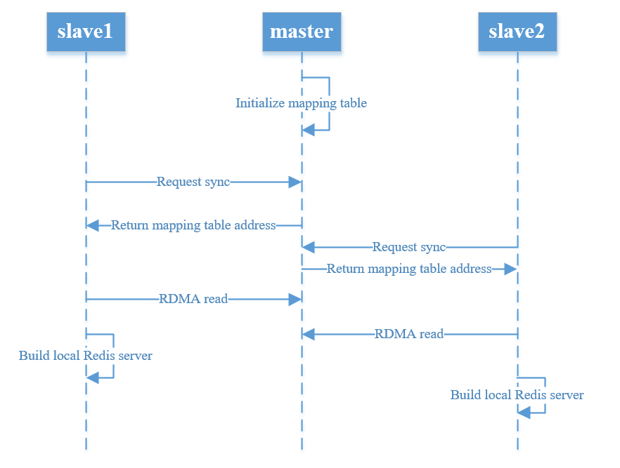
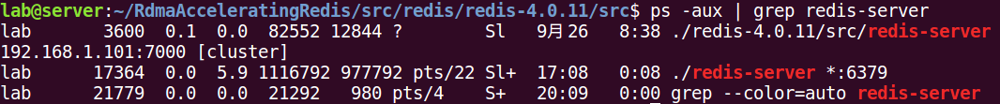
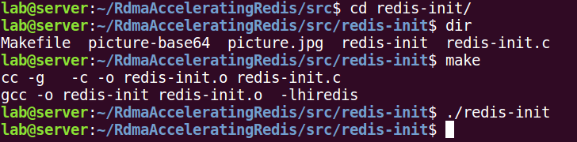
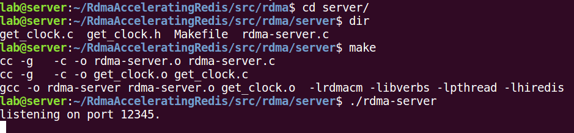
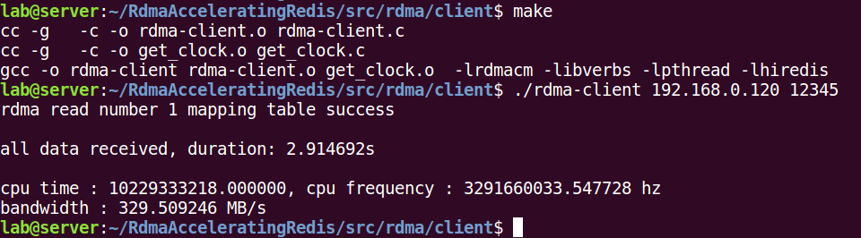

# Rdma Accelerating Redis

## 1 Introduction

Redis implement the replication using Master-Slave strategy. You can initiate Master-Slave mode in Redis by specifying `SLAVEOF` in configuration file or run `SLAVEOF` command in the terminal. Then Redis in slave will replica all the data from the master.

The process of Redis master-slave replication is as follows:

1. slave runs `slaveof` command and then sends requests to master.
2. All in-memory key-value pairs are dumped into local disk by master after receiving request for synchronization. After that, master starts a thread to send the data in disk to slave.
3. slave writes the data into local Redis after receiving the file.

The slave then get the same data as the master after synchronization. We found two challenges in the process:

1. The master dump the data from memory to disk and send out later which incurs the unbearable overhead of Read/Write disk especially when a large amount of data stored in redis. We found that the time for writing the disk during the synchronization occupied more than half of the total time when the master network performance is good.
2. The master is responsible for sending data to all clients which incurs high overload to network and CPU of master. When a large number of slaves request at the same time, the master's network load increases and the network transmission performance decreases seriously.

For the two problems we mentioned above, we implemented a new master-slave synchronization scheme using RDMA.

1. The master creates a in-memory mapping table as buffer for Redis, which saves the time overhead for the master to write data to the disk. And the mapping table can fully take advantage of the RDMA's performance.
2. The slave uses the RDMA `read` to read the data in mapping table in synchronization. Due to the characteristics of RDMA one-sided operation, when multiple slaves read the data of the master's mapping table through RDMA, it does not incur a performance load on the master.

## 2 Experimental Environment & Results

Since the lab does not have a GB-class Ethernet switch, there is only one 100Mb Ethernet router. When we test synchronization within multiple slaves, the machines are connected together by routers. In order to test the performance when using better Ethernet, we connect the Ethernet network card directly with the network cable. 

The experimental environment is as follows:

1. Ethernet network with routers
2. Ethernet network with cable directly
3. RoCE
4. RDMA Verbs

We tested the performance of hardware devices using testing tools:

Table 2-1Bandwidth performance of different hardware devices 

| Device           | Tools      | Bandwidth(MB/s) |
| ---------------- | ---------- | --------------- |
| Disk             | fio        | 96.97           |
| TCP using router | iperf      | 11.78           |
| TCP direct       | iperf      | 117.8           |
| RoCE             | iperf      | 190.72          |
| RDMA             | ib_read_bw | 3180.76         |

We tested the time from master to slave replication from start to finish for different network conditions. The master's Redis server stores a total of 937MB of data. In different network situations, the test results of the time when different slaves complete synchronization are as follows.

Table 2-2 Synchronization Time with disk writing

| Network Type     | one slave(s) | two slave(s) | three slave(s) |
| ---------------- | ------------ | ------------ | -------------- |
| TCP using router | 98           | 174.3        | 259.9          |
| TCP direct       | 19.0         | 21.1         | \              |
| RoCE             | 21.03        | 26.67        | 27.09          |
| RDMA             | 0.031        | 0.032        | 0.031          |

The above experimental results have a problem: in the master-slave replication method of RDMA implementation, the master creates a mapping table in memory, and the slave uses the RDMA `read` operation to directly read the data in the master memory. TCP using router, TCP direct, and RoCE all require the master to dump data in memory to disk first. We use Redis' C programming interface to implement a simple program that eliminates the time the master writes to the disk.

```c
#define KEY_COUNT 256
clock_t time_start, time_end;
int main(){
    redisContext* redis_conn = redisConnect("192.168.1.102", 6379); 
    redisContext* redis_conn_local = redisConnect("127.0.0.1", 6379); 
    if(redis_conn->err)   
        printf("connection error:%s\n", redis_conn->errstr); 
    int start = 0;
    time_start = clock();
    redisReply* reply = NULL;
    while(start++ < KEY_COUNT){
        reply = redisCommand(redis_conn, "get %d", start);
        redisCommand(redis_conn_local, "set %d %s", start, reply->str);
    }
    time_end = clock();
    double duration = (double)(time_end - time_start) / CLOCKS_PER_SEC;
    printf("time: %fs\n", duration);
    return 0;
}
```

Table 2-3 Synchronization Time without disk writing

| Network Type     | one slave(s) | two slave(s) | three slave(s) |
| ---------------- | ------------ | ------------ | -------------- |
| TCP using router | 87.6         | 154.3        | 243.2          |
| TCP direct       | 4.89         | 5.05         | \              |
| RoCE             | 2.55         | 2.62         | 2.65           |
| RDMA             | 0.031        | 0.032        | 0.031          |

**Note:** In table 2-2 and table 2-3, synchronization time for three slaves in TCP direct Network is missed because we meet some experimental environment configuration problems.

## 3 RDMA Master-Slave Solution

We implemented an master-slave synchronization solution by using RDMA, and the main reasons for the performance improvement are as follows:

1. The data transfer between master and slave is via RDMA read. RDMA read is a one-side operation, all slaves can read data from the master memory in parallel, without incurring network competition.
2. The master's data does not be written to disk. The master creates a mapping table in the memory. The mapping table is composed of consecutive fixed-size data areas. The master maps the key-value stored in the memory to the mapping table, and the slave obtains data from the mapping table.
3. The slave only knows the starting address of the mapping table on the master. The slave calculates the address of the data on the mapping table by adding the starting address, and directly reads the data from the master memory area by using RDMA read. Figure 3-1 shows the detailed process.




Figure 3-1 Master-slave using RDMA and Mapping Table


The master-slave synchronization scheme implemented by RDMA has outstanding performance. The performance of master and slave synchronization is not affected by the number of slaves, which benefits from RDMA read one-sided operation. In the Redis TCP master-slave model, the master sends the file in the disk to all slaves. The more slaves, the greater the network pressure of the master and the worse the performance of the transmission. However, the RDMA master-slave hands over the task of acquiring data to the slave. With the RDMA unilateral operation and the kernel-bypass feature, the performance of data synchronization will hardly be affected no matter how many slaves. 

## 4 How to Run

The experimental hardware environment and software environment are as follows:

| Hardware                     | Configuration                          |
| ---------------------------- | -------------------------------------- |
| CPU                          | Intel(R) Core(TM) CPU i7-7700@ 3.60GHz |
| Memory                       | 16GB                                   |
| Disk                         | TOSHIBA 1T HDD                         |
| Infiniband Switch            | Mellanox MSX1012B-2BFS 40GE QSFP       |
| Infiniband Network Interface | Mellanox MCX353A-FCBT 40GbE            |
| Ethernet Router              | Tplink                                 |
| Ethernet Network Interface   | Realtek PCIe GBE                       |

| Software          | Configuration                                  |
| ----------------- | ---------------------------------------------- |
| OS                | Ubuntu 16.04.3 LTS                             |
| Infiniband Driver | MLNX_OFED_LINUX-4.4-2.0.7.0-ubuntu16.04-x86_64 |
| Redis             | 4.0.11                                         |
| Gcc               | 5.4.0                                          |
| hiredis           | Included in redis 4.0.11                       |

In the repository, the `src` directory contains three directories, where the `redis` directory contains the redis source code with the modified configuration file; the `redis-init` directory contains the code first to initialize the data in the redis database; the `rdma` directory includes the `client` and `server` directories, which are used to run on the slave and master respectively.

The Infiniband driver is required but not described here. The only plugin the user needs to install is `hiredis`, which is a C language redis library that is included in the redis source. Here's how to install `hiredis`.

```shell
tar -zxvf redis-4.0.11.tar.gz
cd redis-4.0.11/deps/hiredis/
make 
sudo make install
```

After the installation is complete, a file named `libhiredis.so` will be generated in the current directory, and the file must be copied to `/usr/lib64`. If the `/usr/lib64` directory does not exist, shared object file must be copied to the `/usr/lib` directory. Then update the dynamic link library cache.

```shell
sudo cp libhiredis.so /usr/lib64
sudo /sbin/ldconfig
```

Here, `hiredis` is installed successfully, we can use the `hiredis` header file in the C language to operate Redis.

### 4.1 Master-Slave Cluster

Here's how to run the program we provide to get the results we described above. We assume that we are building a master and two slave environment tests.

Execute `make` command in the `redis-4.0.11/` directory to compile Redis. Then run `redis-server` in `src/`directory with specified configuration file.

```shell
cd redis-4.0.11
make
cd src
```

Before we run redis-server, we should make sure that there are no other redis-server running, we could use `ps` , if there are some redis-server running in this computer, you should use `kill` to stop them.



After that, we can run redis-server safely.

```shell
./redis-server ../redis.conf
```


**NOTE:** The other two machines also start the `redis-server` in the same way above.

Now assume that the three machines are configured as follows:

| Name   | IP            | Port |
| ------ | ------------- | ---- |
| master | 192.168.1.100 | 6379 |
| slave1 | 192.168.1.101 | 6379 |
| slave2 | 192.168.1.102 | 6379 |

Now set slave1 synchronous master data, the master data should be initialized before data synchronization, this section refers to 3.2 summary. First open a new terminal on the master machine into `src` directory, and perform a `redis-cli` connection to slave1.

```shell
cd redis-4.0.11/src
./redis-cli -h 192.168.1.101 -p 6379
```

If no exception occurs, the master is already connected to the Redis service of slave1, and then the run `slaveof` command.

```shell
slaveof 192.168.1.100 6379
```

The master and slave1 data synchronization related logs can be seen in the redis-server program output of master and slave1, as shown below:


From the log, we can see the time from the start of the slave synchronization to the receipt of all the master data and stored in memory, based on which we can calculate the performance of the synchronization.

The above is the process of synchronizing data data between the master and a slave. The process of synchronizing multiple slaves with the master is similar.

### 4.2 Master Data Initialization

The RDMA data synchronization scheme we designed is more suitable for scenarios with larger values and more uniform data. In order to facilitate calculation of bandwidth and comparison performance, we initialize the data of the master. The `redis-init` directory in the `src` directory contains code that initializes the master data.

First enter the redis-init directory, then execute the `make` command, and finally run `redis-init`. Before run `redis-init`, you need to make sure that the `redis-server` program on the master is running.

```shell
cd redis-init
make
./redis-init
```



### 4.3 RDMA Data Synchronization Scheme

The code of the RDMA data synchronization scheme is divided into two parts, the `server` directory and the `client` directory in the `src/rdma` directory. The code of the server directory runs on the master, and the code of the client directory runs on the slave.

Before running RDMA, both the master node and the slave node need to start the Redis server first.

```shell
cd redis-4.0.11/src
./redis-server
```

The master and slave can execute the `redis-server` program directly, and no custom configuration file is required. It is assumed here that the redis-server data on the master has been initialized. If not, refer to section 3-2.

First compile and install the code in the server directory on the master. Go to the `rdma/server` directory, compile the code and run the rdma-server program on the master.

```shell
cd rdma/server
make
./rdma-server
```

In the rdma-server code, the port we fixed the program binding is 12345.



After the rdma-server program starts, it will use `hiredis` to access the key-value data stored in the Redis server on the master and create a mapping table in memory.

Compile and install the code in the client directory on the slave. Go to the client directory under the src directory, compile the code and run the rdma-client program on the slave.

```shell
cd rdma/client
make
./rdma-client 192.168.0.100 12345
```



Rdma-client specifies the IP address and port of rdma-server when running. After the program runs, the client calculates the address of the read data according to the first address of the master return mapping table, and initiates a RDMA read unilateral request directly from the master. Read data in memory. The read data is added to the local Redist database.

All slaves can follow the above instructions to get all the data in sync with the master.