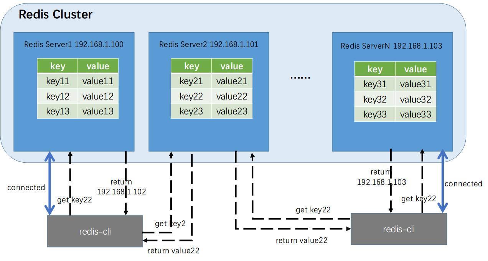
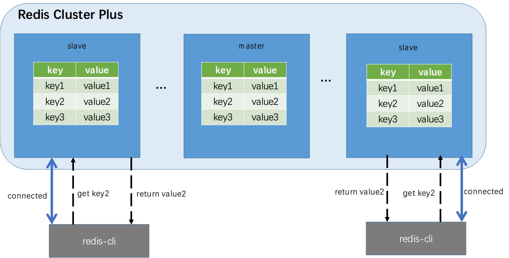

# RdmaAcceleratingRedis

## 1 背景

Redis提供了主从策略，在配置文件中指定slaveof配置项或者在redis-cli中执行slaveof指令，就可以构建master-slave模式的Redis服务。下表1-1是我们为一个具有1GB图片缓冲Redis服务器分别构建一个slave和两个slave的耗时情况。

表1-1 Redis构建slave的耗时情况

| Slave number | Time consuming(s) | Bandwidth(MB/s) |
| ------------ | ----------------- | --------------- |
| one          | 98                | 10.4            |
| two          | 174.3             | 5.87            |
| three        | 259.89            | 3.94            |

Redis主从策略的机制是：master收到slave的同步请求后，将内存中所有的key-value写入本地磁盘中，随后master启动一个线程将文件发送给slave，slave接收到文件再读取写入内存。这样，master和slave就拥有了完全一致的数据，不过在master-slave模式下，slave是只读的，只有master可以接收写。

表1-1的结果是master只有1GB的数据时，slave同请求同步到结束的耗时情况。我们相信，当数据量更多以及更多的slave同时请求作为slave时，master-slave模式的性能更差，主要原因如下：

1. master将内存中所有的数据先写入磁盘，然后通过网络发送。数据被写入磁盘，发送时再从磁盘读取，数据拷贝次数很多，同时磁盘的读写性能也是非常差的；

2. 多个slave请求同步的时候，数据都通过TCP网络传输，TCP网络本身开销很大，当出现竞争的时候性能会更差。


我们觉得使用RDMA实现master-slave模式可以极大的提高性能，实验的结果表明，我们使用RDMA实现的master-slave模式比Redis自带的master-slave模式性能可以提升35倍-80倍，结果如图1-1所示。


Redis本身自带了集群实现方案，通过修改Redis中的配置文件并执行脚本可以将几台独立的Redis服务器组合成一个集群对外提供服务。我们可以集群模式运行redis-cli，或者在其他语言中使用Redis的API接口编写客户端访问Redis集群（比如Jedis），当我们执行set命令向集群中添加一对键值时，程序将这对键值存放在集群的其中一台服务上，也就是说执行set时，这对key-value在系统中只存在一份，即使集群启动的时候指定采用副本，那么一对key-value也只存放在一台Redis服务器和这台服务器对应的副本机器上；当我们执行get命令从集群获取一个key对应的值时，程序帮我们找到这个key所在Redis服务器的，并将value返回给客户端。如图1-1所示：




图1-1 Redis自带的集群方案

我们发现，Redis本身的集群方案有一些值得考虑的地方：

1. 不管集群由多少台机器组成，一对key-value在系统中只存在一份。对于一些应用来说总是存在热点数据，大量的客户端总是访问服务器中一小部分数据。Redis集群方案只是增加了集群的容量，然而并不能为热点数据带来更好的性能；

2. Redis服务是单线程的，这意味着Redis服务器只能在响应一个客户端的请求之后才继续响应下一个客户端的请求。在Redis集群中，客户端连接到集群中某一台Redis服务器，如果客户端get指定的key在当前的Redis服务器中没有被检索到，那么这台Redis服务器负责将请求转发给其他的Redis服务器，并在得到数据后返回客户端结果。在某些应用场景，用户可能同时对一个或几个key发起get请求，所有的请求最终都等待同一台服务器返回结果，增加的延时，且单个服务器的压力过大。


针对上面提到的Redis集群问题，我们准备设计一种新的Redis集群方案，我们称为RCP（Redis Cluster Plus），在RCP集群中，每一台Redis服务器上存储的数据完全相同，客户端不管连接到哪一台Redis服务器上，执行get请求都可以立即得到结果。在RCP集群中，有一台Redis服务器是数据源，我们称为master，其他Redis服务器称为slave。在RCP初始化的时候，master上所有的数据都将同步到slave上，整个集群中每一台Redis服务器都可以独立对外提供服务，当大量的客户端访问RCP集群时，请求分布在集群中所有的Redis服务器，而不需要集中到其中一台，增加了集群并行的能力，可以提升系统的性能。



图1-2 RCP集群

~~利用RDMA可以使我们的集群方案~~

~~我们的目的是使用RDMA优化Redis现有的集群方案，我们的主要工作如下：~~

1. ~~我们改变了现有的集群方案，我们希望一个Redis集群中所有的Redis服务器的数据是完全同步的，每台Redis服务器都可以完全独立、对等的对外提供服务。这样，在遇到前面我们描述的应用场景是，Redis集群可以提供更好的性能。我们设计了测试用例，比较了高负载情况下，Redis自带的集群与我们的集群方案的性能。~~
2. ~~我们利用RDMA设计了一个Redis集群中所有Redis服务器数据同步的程序，与使用Socket进行同步的程序进行了性能上的比较。~~
3. ~~我们尝试用一个上层的RDMA库rsocket替换Redis中已有的socket通信代码。~~


~~	我们的应用场景来源于将Redis作为图片缓存的服务，比如社交软件。服务器将图片放在磁盘中，客户端访问图片时服务器需要在磁盘中查找到图片，在读取到内存中，经过网络发送给客户端。对于图片服务器来说，图片存在热点问题，一小部分图片占据了主要的访问量，将这些图片加载到基于内存的key-value系统是不错的选择。Redis作为图片缓冲的策略是将图片转换成base64的编码存储在Redis服务器中，客户端访问Redis服务器获取图片的base64编码后在本地转码得到原图。~~


## 2 RDMA集群同步方案

上面说到我们设计新的Redis服务器集群RCP，在RCP集群初始化的时候，master上存储的所有数据同步到集群中所有的slave机器上。假设现在有一台Redis服务器上存储了超过10000张大小为4MB的图片base64编码，这10000张图片是离线计算得到的热门图片，现在想将这台Redis服务器作为master建立一个有10台机器的RCP集群以对外提供服务得到更好的性能。如何将master上的数据同步到另外9台Redis服务器是一个大问题。

假设我们采用传统的TCP/IP通信方式，那么同步的过程大概如下：

1. 9台slave分别于master建立TCP连接；
2. master从本地读取一个key-value对，通过socket依次发送给9台slave；
3. slave接收到key-value后将其存到本地的库中；
4. 如果master没有被遍历完，继续步骤2；否则停止。

TCP/IP的方式看起来简单，但是实际上性能很差，我们在测试的时候发现这样的同步方式需要相当长的时间。第一，TCP/IP网络本身数据拷贝和协议栈的开销；第二多客户端同时通信，master网络竞争激烈；第三，同步操作无法完全异步。除了时间开销之外，在同步的时候，master机器的CPU负载非常高，对master本身运行的其他负载会有影响。

我们使用RDMA设计了集群同步的方案，实验表明，我们的同步方案与TCP/IP同步相比，在性能上能提升4倍，集群需要同步的slave越多，我们的同步方案优势越明显，因为我们利用RDMA单边操作，所有的slave并行的从master读取数据。使用RDMA进行同步的过程如下：

1. master建立一个mapping table，其结构如图1-3所示。mapping table分为前后两部分，前面部分是一个一个8 byte大小的地址区域，每个区域用来记录地址；后面部分是一个一个4 MB大小的数据区域，用来存放Redis服务器 中的数据。地址区域与数据区域对应存在，第一个地址区域中保存的是第一个数据区域的地址；
2. 9台slave分别于master建立RDMA连接，在建立连接的过程中，master将mapping table的起始地址发送给每一个slave；
3. slave根据mapping table的起始地址，加上数据的偏移量计算出数据的地址，slave使用计算出的地址发起RDMA read请求，从master读取一个数据区域数据，并将数据存储到本地；
4. 如果计算的地址没有越界，继续步骤3；否则，结束。


 

图1-3 mapping table结构


~~作为对比，我们可以先看看基于Socket的集群备份策略是如何实现的。~~

~~现在假设我们有3台Redis服务器，分别为server1、server2和server3，其中server1已经存储了许多图片缓存，我们希望将server2和server3作为server1的热备份，使用Socket将server1中所有的键值对信息发送给server2和server3，并让server2和server3把收到的数据存储在自己的内存中。具体流程如下：~~

1. ~~server2和server3分别于server1建立Socket连接；~~
2. ~~server1遍历本地Redis库，使用get得到数据，将得到的键值信息依次发送给server2和server3；~~
3. ~~server2和server3收到数据，分别执行set将数据插入到本地的Redis库中。~~

~~第2步是耗时操作，~~


## 3 环境搭建

本文所有的测试工作均在Ubuntu 16.04下完成。

使用Redis集群方案手动地建立3台Master节点的搭建过程如下：

### 3.1 在集群模式下创建Redis实例

为了创建一个cluster，我们首先要配置Redis server运行在集群模式下。因此可以用以下的配置脚本文件：

```shell
bind 192.168.1.100	#这个参数根据每个Node的IP有所不同
port 7000
cluster-enabled yes	#启用集群模式
cluster-config-file nodes.conf
cluster-node-timeout 5000
appendonly yes
```

然后建立3份编译好的Redis实例拷贝到3个文件夹隔离，并分别按照上述的配置文件启动server：

```shell
mkdir cluster-test
cd cluster-test
./src/redis-server ./cluster.conf	#按照上述配置文件启动server
```

### 3.2 用Redis实例建立集群

通过Redis提供的一个基础程序`redis-trib`可以方便地对集群进行操作，这个程序使用Ruby编写，放置在`src/`中。因此需要安装ruby的开发环境和对应的redis接口。前置准备工作完成后可以通过以下命令建立集群。

```shell
./redis-trib.rb create {ip-1}:7000 {ip-2}:7000 {ip-3}:7000
```

这样的简单命令只创建了3台Master Node构成的集群，没有任何备份用的Slave Node。

## 4 Redis集群工作原理简述

Redis cluster是多个Redis实例组成的一个整体，Redis用户只关心他所存储的数据集合，不关心数据在这个集群中是怎么被放置的。Redis cluster具有Master节点互相连接、集群消息通过集群总线通信、节点与节点之间通过二进制协议通信、客户端和集群节点之间通过文本协议进行等特点。

### 4.1 Redis集群分区实现原理

Redis cluster中有许多不同编号的slot，这些slot是虚拟的。cluster工作的时候，每个Master节点负责一部分slot，当有某个key映射到某个Master负责的slot后，这个Master负责为这个key提供服务。

Master节点维护一个位序列，Master节点用bit来标识对于某个slot是否属于自己管理。在Redis cluster中，我们拥有16384个slot，这个数是固定的，我们存储在Redis cluster中的所有的key都被映射到这些slot中，key到slot的基本映射算法如下：

```shell
HASH_SLOT = CRC16(key) mod 16384 
```

### 4.2 重定向客户端

Redis cluster并不会代理查询，那么如果客户端访问了一个key不存在的节点，那么客户端就会接收到一条信息，告诉客户端想要的slot所在真正的Master node。


## 5 RDMA网络备份策略

在基于RDMA网络的Redis集群中，假设我们有3台server即3台Master node，分别为server1、server2、server3。同样地，server2和server3是server1的热备份，因此server1的数据通过RDMA网络发送到server2和server3里。

具体的备份过程如下所示：

1. 备份前server1存储的图片均在server1的redis数据库中

2. server启动网络服务，等待client的连接

3. server收到client的请求后，通过get操作查询redis数据库，并获取编码后的图片信息

4. server将查询的图片编码信息存入申请好的内存空间内，这一段内存空间的结构如下所示。第一个段是标志位序列，用来标记哪些图片是最新修改的。第二个段是存储图片编码的数据块，以数组方式组织，每个数据块的大小是4MB。

   

5. server将上述数据结构的首地址通过`ibv_post_send`操作以工作请求的方式放到发送队列，由RDMA网络发送给client

6. client端收到图片数据存放的首地址信息后，通过标志位查询哪些图片数据是修改后还没commit的，然后将所有修改的数据块读入。读入的操作是通过`ibv_post_send`操作，计算Addr和Flag标志位产生的偏移量，得到修改后数据存放的地址，然后读入client端对应的申请的内存空间中，即前述的数据结构中。

7. client端读入数据后，通过redis的set操作，把数据存入本地redis数据库完成热备份的整个流程


## 6 实验结果