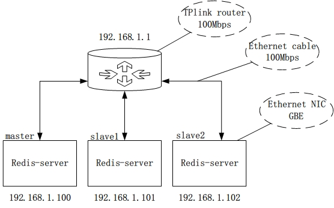
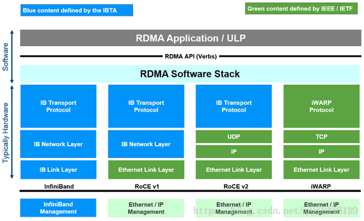
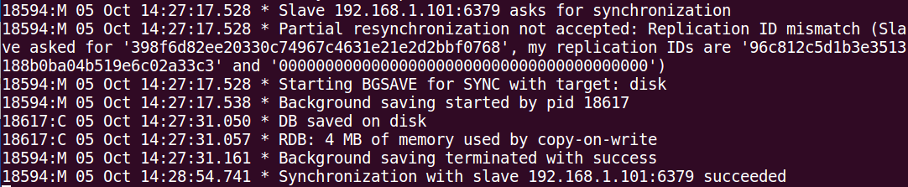
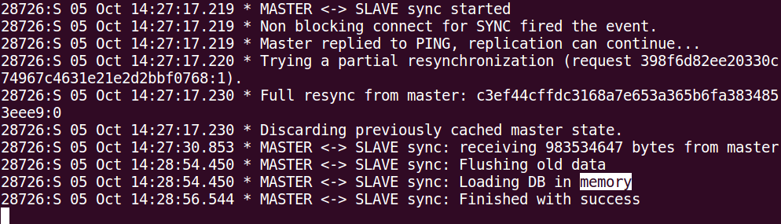
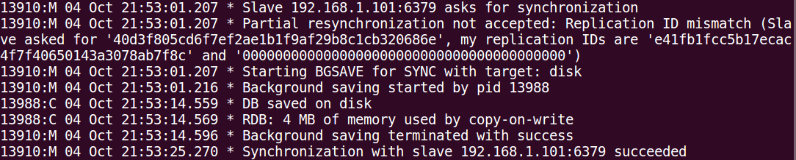
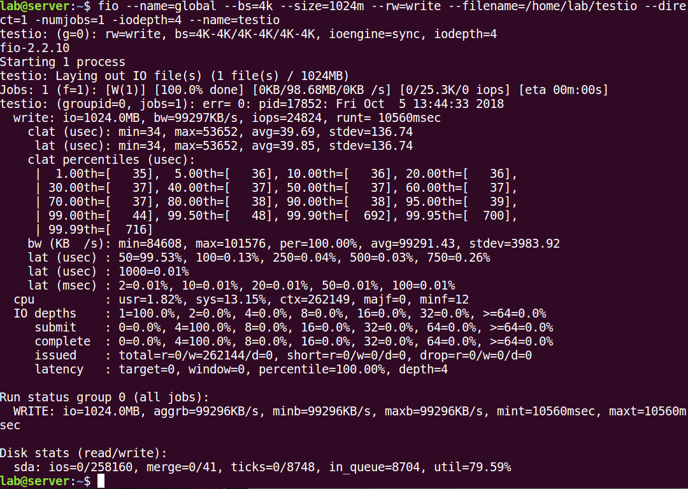
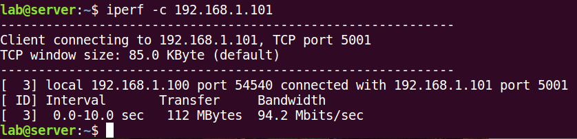
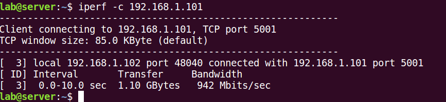
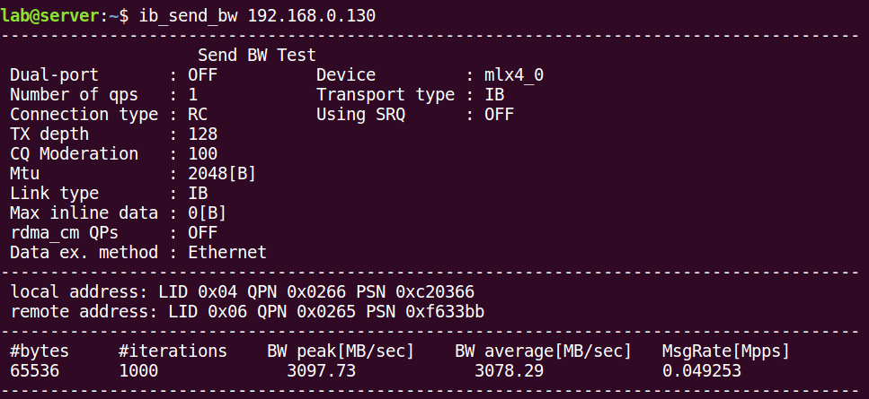
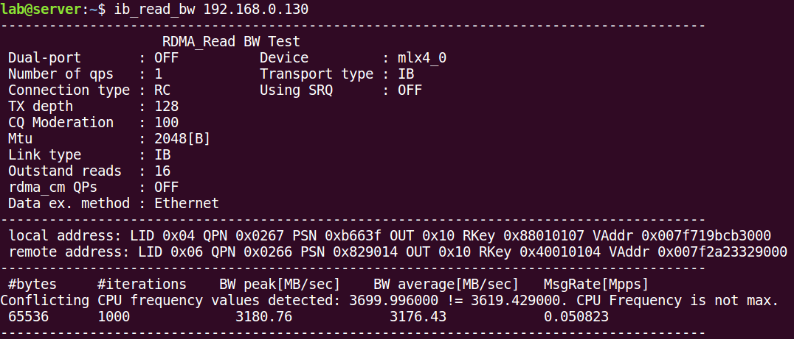

The network structure we used in the previous experiment is as follows：



Figure 1-1 Master-slave based on TCP using router


Figure 1-2 Master-slave based on RDMA

Figure1-1 and Figure1-2 above are all one master and two slaves. All machines are connected to the router when using Ethernet, and All machines are connected to the Mellanox Switch when using RDMA. The reason why we uses a 100Mbps router is that our lab doesn't have a Gb Ethernet switch. But our experiments require multiple machines to be connected, so we have to use a router. If there are only one master and one slave, they can connected directly by cable, without using router, the performance of the master-slave synchronization will improved. I will show you some new test data in **part 2**.

## part 1 (question 1,2,5,6,8)

Firstly, I want to talk about question 1、2、5、6 and 8.

As for question 1, The network structure of our previous two experiments are:

-100Mb with TCP

-40GE with RDMA verbs（Not RoCE）


For question 2 and 5, 

we call "redis master-slave", which means Redis's `slaveof` instruction synchronizes master and slave data;  "RDMA master-slave" refers to the master and slave data synchronization we implemented by using `RDMA Verbs`.


I'm so sorry for that I marked the wrong data in readme. I have corrected Figure1-3 in readme.

We use "bandwidth" to compare experiments, we calculate the bandwidth by dividing the total amount of data transferred by the synchronization completion time. To be honest, we shouldn't use "bandwidth" to compare experiments, "Time consuming" is much better. Synchronization completion time includes not only the data transfer time, but also other times, such as data write time to disk.


Question 6 mentioned Figure1-2 in readme which shows a comparison of two different synchronization methods:

method1: using TCP(100Mb) and file writing to disk in the slave and master.

method2: using RDMA(56Gb) without file writing to disk, only using memory. 


For question 8, about RoCE. In the previous comparison, we only focused on the comparison between the two types of master-slave data synchronization schemes(TCP using router and RDMA). We haven‘t tested RoCE. 

I have read the introduction of RoCE in related articles and papers, but I don’t know much about RoCE. My understanding of RoCE is that if we specify a TCP/IP program to use Mellanox network card to communicate, this communication is RoCE. I am not sure if I understand it.




Figure1-3 RDMA supported protocol


According to your questions, we did four tests, all of the following tests using one master and one slave, master contains 937MB data in Redis server, they have different network connections:

- TCP using router
- TCP Direct
- RoCE
- RDMA read

These four type of connections' time consuming as following：

| Connection | TCP Using Router | TCP Direct | RoCE  | RDMA |
| ---------- | ---------------- | ---------- | ----- | ---- |
| Time(s)    | 97.21            | 24.06      | 24.14 | 2.8  |


## part 2 (question 4,7,10,13)

Question 7 asked why Redis' master-slave mechanism needs to write memory data to disk. In this regard, we refer to the relevant information on the Internet. What's more, in the Redis running log, we can also confirm that the master writes the memory data to the local disk after receiving the slave request.



Figure 1-4 The log of master during data synchronization when TCP using router



Figure 1-5 The log of slave during data synchronization when TCP using router

From the log above, we can notice that after the slave requests synchronization, the master checks whether resynchronization can be performed (the resynchronization is permitted if the slave synchronized with the master before), if resynchronization is not available, the master writes the data to the disk file, and then the file is sent to the slave. The slave loaded the file into memory after receiving the file.

The questions 4 and 10 can also be answered here.



Figure 1-6 The log of master during data synchronization when **TCP Direct** 


Figure 1-7 The log master during data synchronization when **using RoCE**

The logs of master and slave data synchronization are shown in Figure 1-3, Figure 1-5, and Figure 1-6.

- Figure 1-4 shows TCP with a router
- Figure 1-6 shows the TCP Direct
- Figure 1-7 shows RoCE

Let's organize the data and we can see:

| Connection            | TCP Using Router | TCP Direct | RoCE  |
| --------------------- | ---------------- | ---------- | ----- |
| Total time(s)         | 97.21            | 24.06      | 24.14 |
| File write time(s)    | 13.52            | 13.36      | 13.48 |
| Data transfer time(s) | 83.69            | 10.7       | 10.66 |

We wrote a C program whose function is to get the value from a Redis server (master) and immediately set it to the local Redis server (slave), reading the same amount of data as the previous test. The function of this program is similar to the master's need to write data to the local disk, while synchronizing the in-memory data to the slave. The code is shown as below.

```c
#define KEY_COUNT 256
clock_t time_start, time_end;
int main(){
    redisContext* redis_conn = redisConnect("192.168.1.102", 6379); 
    redisContext* redis_conn_local = redisConnect("127.0.0.1", 6379); 
    if(redis_conn->err)   
        printf("connection error:%s\n", redis_conn->errstr); 
    int start = 0;
    time_start = clock();
    redisReply* reply = NULL;
    while(start++ < KEY_COUNT){
        reply = redisCommand(redis_conn, "get %d", start);
        redisCommand(redis_conn_local, "set %d %s", start, reply->str);
    }
    time_end = clock();
    double duration = (double)(time_end - time_start) / CLOCKS_PER_SEC;
    printf("time: %fs\n", duration);
    return 0;
}
```

We adjusted the network environment and got the data:

| connection | TCP Using Router | TCP Direct | RoCE | RDMA |
| ---------- | ---------------- | ---------- | ---- | ---- |
| time(s)    | 6.81             | 2.92       | 2.58 | 2.8  |

Based on the above test, we conclude that:

- The `slaveof` command writes data to disk which is a time consuming operation. When the network performance is good, this overhead takes more than half of the time;
- After removing the process of master writing files and transferring files, the synchronization performance of master and slave of TCP using router, TCP Direct and RoCE is greatly improved, and RoCE is even better than RDMA;

However, the experiments above were all tested on one master and one slave. We believe that the TCP test results will be worse when using more machines for testing.

At present, the data synchronization result of our RDMA program in a master and a slave is not satisfactory. We believe that our program using RDMA read will show advantages when more machines are synchronizing data. Because our design philosophy is that the master creates a mapping table for the data, all other slaves use RDMA read to get data directly from the master. The slave is responsible for calculating how to get the data, and the master requires almost no intervention. Utilizing the advantages of RDMA read unilateral operation, our performance remains stable no matter how many slaves request data from the master at the same time.

In the above results, the use of RoCE is faster than the RDMA read we wrote, mainly because of the time-consuming operation in our RDMA code. When the slave machine reads the value data from the master using the RDMA read, the slave needs to execute the Redis set command to add the data to the local Redis server. However, in the experiment we found that the data of the RDMA read must be copied to a buffer, and when the read data is at a size of 1 MB, the data copied by the memcpy function always encounter error. We can only copy one character and one character in the code.

```c
#define ARR_LEN 1024 * 1024 * 4
char *dis=conn->rdma_local_region + max_mapping_table_size + k * block_size;
while(j < ARR_LEN)
{
	s[j]=(unsigned char)*((dis + j));
	j++;
}
```

Copy operation costs a lot of time, if our RDMA code does not execute this loop, just read data from the master, the whole process takes 1.02s, and the performance can be improved by 63.6%. But until now,  we haven't found a solution yet.

Question 13 is asking why our RDMA read does not reach the bandwidth that the hardware environment should have. The maximum bandwidth of our hardware environment is 3180MB/s. If we remove the code of the data copy we mentioned above in our program, our RDMA code read whole data costs 0.0082s and the bandwidth is 2754.92MB/s. We are still making some explore, hoping to solve the problem that is cause low performance.


## part 3 (question 3,11,12)

Now, I will give some data about our experimental environment, in order to answer question3, 11 and 12. 

Test local disk by using `fio`：



Figure1-8 Local Disk Performance

Test network performance by using `iperf`:



Figure 1-9 TCP Using Router



Figure 1-10 TCP Direct


`ib_send_bw` and `ib_read_bw`：



Figure 1-11 ib_send_bw



Figure 1-12 ib_read_bw


 

